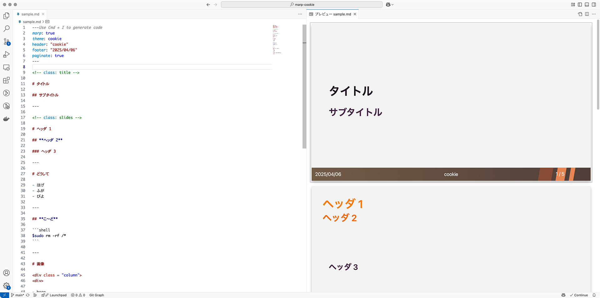

# MARP-COOKIE



## これはなに

ぼくの ぼくによる ぼくのための Marp カスタムテーマです。

## 公開先

<https://cookie-kumano.github.io/marp-cookie/marp-cookie.css>

Marp for VSCode では、 `markdown.marp.themes` に上記リンクを設定することで使えます。

markdown のヘッダ部分で設定する `theme` の名前は `cookie` です。

## 使い方

`sample.md` を参照するとなんとなくわかるはずです。

### テンプレートの類型

| 名前   | 内容                                                           |
| ------ | -------------------------------------------------------------- |
| title  | タイトルページ。ヘッダー文字列が天地中央にどデカく表示される。 |
| slides | スライド本文ページ。ヘッダー文字列は左上に表示される。         |

### 茶色いフッターに表示される文字列

markdown のヘッダ部分で定義した値が入ります。右下には固定でページ数が表示されます。

| 表示位置 | 設定箇所                                 |
| -------- | ---------------------------------------- |
| 左下     | footer                                   |
| 中央     | header                                   |
| 右下     | paginate を true で表示、 false で非表示 |

したがって、このテーマを使用する場合ヘッダ部分は次のようになります。

```
---
marp: true
theme: cookie
header: "cookie"
footer: "2025/04/06"
paginate: false
---
```

### ややこしい部分

フッターにオレオレカスタムが入っているので、画像の記法（`![bg right]`など）を使うと意図した表示にならない場合があります。

画像を左右半分に表示したい場合は、次のように書くとうまくいきます（この例では右半分に画像が表示される）。

```
<div class = "column">
<div>

- hoge
- fuga

</div>


</div>
```

追々なんとかしたい箇所ではある
